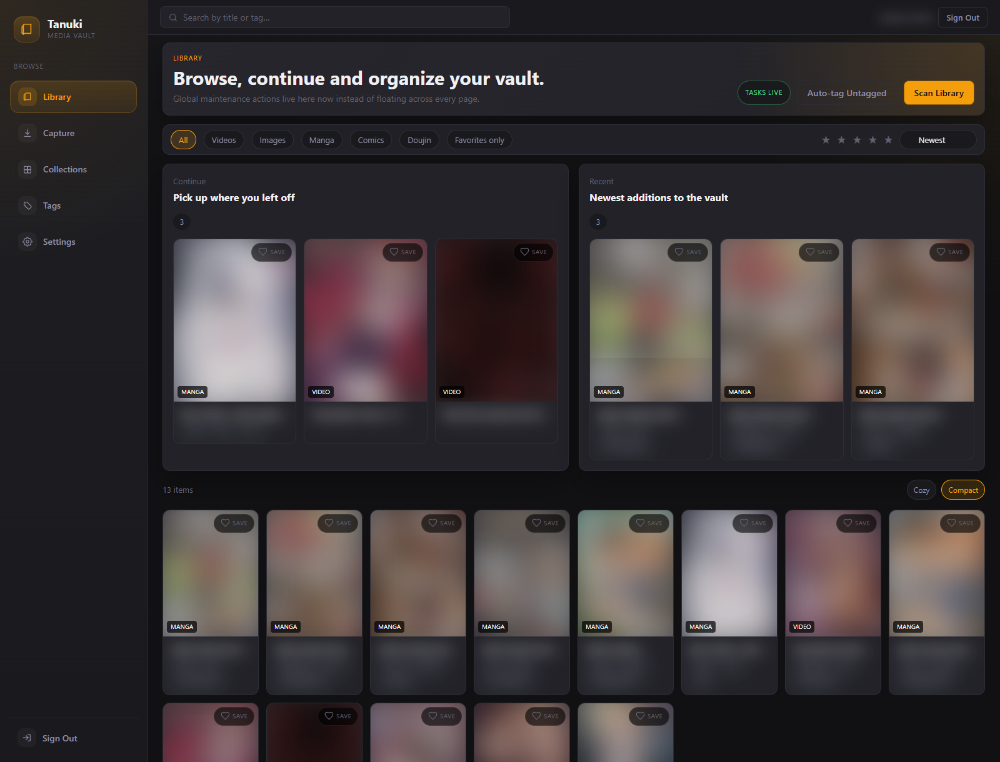

# Tanuki

Tanuki is a self-hosted media vault for mixed libraries that include videos, images, manga, comics and source downloads. It combines scanning, playback, reading, metadata management, downloads, auto-tagging, duplicate detection and collections in a Docker-based stack.



Tanuki is designed for self-hosted deployments with a shared library model, background workers, and persistent storage for application secrets, database data, media, and generated assets.

## Core Capabilities

### Library

- Recursive scan of `/media`
- Automatic media type detection for common video, image and archive formats
- Thumbnail generation for local media
- Metadata editing in the browser
- Optional delete from database only or from disk as well

Supported library media types:

- `video`
- `image`
- `manga`
- `comic`
- `doujinshi`

Supported archive reader formats:

- `.cbz`
- `.zip`
- `.cbr`
- `.rar`

### Reader and Player

- Video playback with resume support
- Manga and comic reader with single-page, double-page, scroll and RTL modes
- Persistent reader and player preferences in the browser

### Downloads

- Queue-based download manager
- Scheduled downloads
- Batch URL submission
- Automatic organize and follow-up scan after completion
- Site-specific connectors plus `yt-dlp`, `gallery-dl` and direct HTTP fallback

Currently supported public connectors:

- `hentai0.com`
- `doujins.com`
- `rule34.art`
- `danbooru.donmai.us`
- `safebooru.org`
- `gelbooru.com`

### Metadata and Organization

- Tag search and tag-based filtering
- Reverse-image auto-tagging
- Duplicate detection via perceptual hash
- Manual collections
- Smart collections based on type, title, tag, favorite flag and minimum rating

### Access Control

- Multi-user authentication
- Admin-only user management
- Admin-only plugin management

## Architecture

The default stack contains five services:

| Service | Purpose | Port |
|---|---|---|
| `app` | HTTP API and compiled frontend | `8080` |
| `worker` | library scans, thumbnails, background processing | - |
| `downloader` | queued and scheduled downloads | - |
| `db` | PostgreSQL 16 | internal |
| `cache` | Redis 7 | internal |

Runtime paths inside the containers:

- media library: `/media`
- inbox: `/inbox`
- thumbnails: `/thumbnails`
- downloads: `/media`

Host paths in the default Docker setup:

- library files: `./media`
- intake folder: `./inbox`

## Quick Start

### Requirements

- Docker
- Docker Compose

### First Startup

```bash
git clone https://github.com/nacl-dev/Tanuki.git
cd Tanuki
cp .env.example .env
```

Secret handling:

- if `SECRET_KEY` is left empty, Tanuki generates a strong key on first start and stores it in the persistent `config` volume
- if you prefer external secret management, set `SECRET_KEY` manually to a random value of at least 32 characters
- optionally set `JWT_SECRET` separately if you do not want it to fall back to `SECRET_KEY`

Start the stack:

```bash
docker compose up -d --build
```

Open the application:

- [http://localhost:8080](http://localhost:8080)

Verify basic health:

```bash
docker compose ps
curl http://localhost:8080/api/health
```

### What Happens on First Boot

- Docker bind mounts create `media/` and `inbox/` automatically
- if `SECRET_KEY` is empty, Tanuki creates `/app/config/secret.key` once and reuses it on later starts
- the backend applies database migrations on startup
- the worker performs an initial scan cycle
- the first registered user becomes admin

## Configuration

The stack works with sensible defaults, but the following variables are the important operational ones.

| Variable | Default | Purpose |
|---|---|---|
| `PORT` | `8080` | HTTP port exposed by the app container |
| `DATABASE_URL` | `postgresql://tanuki:secret@db:5432/tanuki?sslmode=disable` | PostgreSQL DSN |
| `REDIS_URL` | `redis://cache:6379` | Redis connection string |
| `MEDIA_PATH` | `/media` | library root |
| `INBOX_PATH` | `/inbox` | import root |
| `THUMBNAILS_PATH` | `/thumbnails` | thumbnail storage |
| `DOWNLOADS_PATH` | `/media` | allowed download root |
| `SECRET_KEY` | auto-generated if empty | application secret, minimum 32 characters |
| `SECRET_KEY_FILE` | `/app/config/secret.key` | persistent file used when `SECRET_KEY` is not set |
| `JWT_SECRET` | falls back to `SECRET_KEY` | JWT signing key |
| `JWT_EXPIRY_HOURS` | `24` | login token lifetime |
| `REGISTRATION_ENABLED` | `true` | allow self-registration |
| `SCAN_INTERVAL` | `300` | automatic scan interval in seconds |
| `MAX_CONCURRENT_DOWNLOADS` | `3` | parallel download jobs |
| `RATE_LIMIT_DELAY` | `1000` | delay between source requests in ms |
| `DOWNLOADER_COOKIES_FILE` | empty | optional Netscape `cookies.txt` path |
| `YTDLP_IMPERSONATE` | `chrome` | yt-dlp impersonation target |
| `SAUCENAO_API_KEY` | empty | SauceNAO API key for auto-tagging |
| `IQDB_ENABLED` | `true` | IQDB fallback toggle |
| `AUTOTAG_SIMILARITY_THRESHOLD` | `80` | minimum confidence for auto-tagging |
| `AUTOTAG_ON_SCAN` | `false` | auto-tag during scan |
| `AUTOTAG_RATE_LIMIT_MS` | `5000` | auto-tag request spacing |
| `DUPLICATE_THRESHOLD` | `10` | pHash duplicate threshold |
| `PHASH_ON_SCAN` | `true` | calculate pHash during scan |
| `PLUGINS_ENABLED` | `true` | plugin system toggle |
| `PLUGINS_PATH` | `/app/config/plugins` | plugin directory |

See `.env.example` for the complete example file.

## Typical Workflows

### Import Existing Files

1. Copy files or folders into `./inbox`
2. Trigger library scan or organize from the UI
3. Tanuki moves or copies files into the managed library structure
4. The worker generates thumbnails and updates metadata

### Download from a Supported Source

1. Open the Downloads page
2. Paste one or more supported URLs
3. Monitor progress in the queue
4. Finished files are organized and scanned into the library

For stricter sources behind browser verification, export a Netscape-format `cookies.txt` file and set `DOWNLOADER_COOKIES_FILE` to a mounted path, for example `/media/.cookies/rule34.txt`.

### Build Smart Collections

Examples:

- all videos with titles containing `Venus Blood`
- all media tagged `tentacles`
- all favorites with rating `4` or higher

## Multi-User Model

Tanuki uses a shared-library model with user-specific areas where it makes sense:

- media files and tags are shared across the instance
- collections are user-scoped
- download jobs are user-scoped
- download schedules are user-scoped
- runtime and path details are visible only to admins
- plugins are admin-only

Tanuki does not currently provide strict per-user library isolation.

## Security and Operational Notes

- keep the `config` volume persistent if you use the auto-generated secret
- download targets are restricted to configured managed roots
- protected media responses are sent with private caching
- plugin management is restricted to admin users
- path and runtime details are reduced for non-admin users

Recommended production practices:

- put the stack behind a reverse proxy with TLS
- keep `.env` out of version control
- back up PostgreSQL and the `media/` volume regularly
- mount `config/` and `plugins/` persistently if you use them
- restrict host access to the Docker socket and runtime directories

## Base Path and Reverse Proxy Notes

The frontend supports deployment behind a subpath via `BASE_URL` in the Vite build. If you publish Tanuki behind a reverse proxy prefix, make sure the built frontend and the proxy path agree.

Health endpoints:

- `/healthz`
- `/api/health`

## Project Layout

```text
Tanuki/
  backend/
    cmd/
      server/
      worker/
      downloader/
    internal/
      api/
      auth/
      autotag/
      config/
      database/
      dedup/
      downloader/
      models/
      plugins/
      scanner/
      thumbnails/
    migrations/
  frontend/
    src/
      api/
      components/
      pages/
      router/
      stores/
  config/
  docs/
  media/
  inbox/
  docker-compose.yml
  Dockerfile
```

## Development and Verification

Useful local checks:

```bash
cd backend
go test ./...

cd ../frontend
npm run lint
npm run test
npm run build
```

Container build verification:

```bash
docker compose config
docker build --target app -t tanuki-release-check .
```

Note about `go test -race`:

- the race detector requires CGO
- if your local environment does not include a C toolchain, install one first, for example Visual Studio Build Tools, LLVM or MinGW, and make sure it is available on `PATH`

## Limitations

- the library itself is shared across users
- plugins are available only when Python-based plugin execution is enabled
- stricter source sites may still require browser-exported cookies
- operational hardening beyond the provided Compose stack is the responsibility of the deployment

## License

[MIT](LICENSE)
